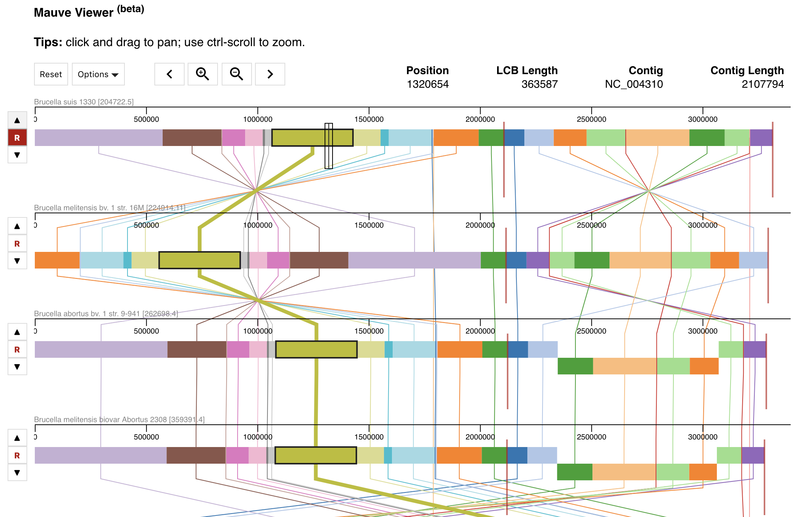

# mauve-viewer

A JavaScript Mauve/.xmfa viewer for multiple whole genome alignments.   The UI is highly inspired by the original [Mauve](http://darlinglab.org/mauve/mauve.html) viewer, with web/application integration in mind.  Note this is a __work in progress__.

[Demo](https://nconrad.github.io/mauve-viewer/demo/)

Alignment of 11 Brucella reference genomes:


      
Zooming in to view features/annotations of Ecoli:


      
    

## Why?

The original [Mauve](http://darlinglab.org/mauve/mauve.html) viewer is great, but it's written in Java and doesn't run in the browser.  I'm particularly interested in creating a general purpose solution for genome alignment tools, such as [Mummer4](https://github.com/mummer4/mummer).

Collaboration is welcome!


## Features

- panning, scaling, zoom
- tooltips (Todo: make customizable)

#### Upcoming:

- SVG Download
- Canvas resizing
- Performance improvements?


## Dependencies


- [d3](https://github.com/d3/d3) v5.0+

`MauveViewer` does not currently package d3.js and takes a reference to `d3` when instantiating the viewer.  See below.


## Usage

*First, make sure the CSS is included:*
```
<link rel="stylesheet" type="text/css" href="dist/mauve-viewer.css">
```


#### Global

```
<script src="https://d3js.org/d3.v5.min.js"></script>
<script src="dist/mauve-viewer.js"></script>
```

See example [here](https://github.com/nconrad/mauve-viewer/blob/master/demo/global-demo/index.html).

#### ES6

```
import * as d3 from 'd3';
import MauveViewer from 'dist/mauve-viewer';
```

#### AMD

```javascript
requirejs.config({
    baseUrl: 'dist',
});

requirejs([
    'mauve-viewer', 'path/to/d3'
], function (MauveViewer, d3) {
    ...
})
```

See example [here](https://github.com/nconrad/mauve-viewer/tree/master/demo/amd-demo).


### Basic Example Config

```html
<body>
      <!-- note: canvas auto-resizing is not implemented yet -->       
      <div class="mauve-viewer" style="margin: 0 auto; width:1024px;"></div>
</body>
```      

```javascript
let mauveViewer = new MauveViewer({
    d3: d3,
    ele: document.querySelector('.mauve-viewer'),
    lcbs: [
        [
            {
                "name": "track 1",
                "start": 200,
                "end": 300,
                "strand": "+",
                "lcb_idx": 1
            },
            {
                "name": "track 2",
                "start": 100,
                "end": 200,
                "strand": "+",
                "lcb_idx": 2
            }
        ]
    ]
})
```

### Config

| Param                 | Type                              | Required? |
|-----------------------|-----------------------------------|-----------|
| d3                    | Reference to d3                   | &check;   |
| ele                   | DOM element                       | &check;   |
| [lcbs](#lcbs)         | LCBs (list of lists)              | &check;   |
| [labels](#labels)     | Object (see below)                | -         |
| [features](#features) | Object (see below)                | -         |
| [contigs](#contigs)   | Object (see below)                | -         |


### Event Callbacks

| Param          | Type                | Required? | Default |
|----------------|---------------------|-----------|---------|
| onFeatureClick | function(Object) {} | -         | -       |


##### lcbs

Each LCB is grouped as an Array of Objects.  To parse `.xmfa` files into json-formatted LCBs, you may consider using this [script](https://github.com/nconrad/p3_mauve/blob/master/scripts/mauve-parser.js).  It's based on [biojs-io-xmfa](https://github.com/erasche/biojs-io-xmfa).  It can be ran as follows:

```
git clone https://github.com/nconrad/p3_mauve && cd p3_mauve
npm install
node ./scripts/mauve-parser.js --input test-data/alignment.xmfa > lcbs.json
```

`lcbs.json`:

```javascript
[
    [
        {
            "name": "224914.11.fasta",
            "start": 6,
            "end": 2003350,
            "strand": "-",
            "lcb_idx": 1
        }, ...
    ], ...
]  
```

##### labels (optional)

This is a mapping from the `name`/path of the fasta file to a more meaningful name, such as the organism name.

```javascript
{
    "224914.11.fasta": "Brucella melitensis bv. 1 str. 16M",
    "204722.5.fasta": "Brucella suis 1330",
    "444178.3.fasta": "Brucella ovis ATCC 25840",
    "262698.4.fasta": "Brucella abortus bv. 1 str. 9-941",
    "483179.4.fasta": "Brucella canis ATCC 23365"
}
````

##### features (optional)

```javascript
{
    "224914.11": [
        {
            "annotation": "PATRIC",
            "feature_type": "tRNA",
            "patric_id": "fig|224914.11.rna.23",
            "product": "tRNA-Met-CAT",
            "strand": "+",
            "sequence_id": "NC_003317",
            "start": 558758,
            "end": 558834,
            "accession": "NC_003317",
            "xStart": 558758,
            "xEnd": 558834
        },
        ...
    ], ...
}
```

##### contigs (optional)

```javascript
{
    "224914.11": [
        {
            "gi": 17986284,
            "sequence_type": "chromosome",
            "topology": "circular",
            "chromosome": "I",
            "length": 2117144,
            "sequence_id": "NC_003317",
            "description": "Brucella melitensis 16M chromosome I, complete sequence.",
            "accession": "NC_003317",
            "gc_content": 57.2,
            "xStart": 1,
            "xEnd": 2117144
        }, ...
    ], ...
}
```


## Development

### Installation

```
npm install
```


### Development

```
npm start
```


### Build

```
npm run build
```

This creates a new build in `dist/`.


## Author(s)

[nconrad](https://github.com/nconrad)


## Citation

In the meantime, please cite this repo:

N. Conrad, A Whole Genome Alignment Visualization Tool for the Web, (2019), GitHub repository, https://github.com/nconrad/mauve-viewer


## License

Released under [the MIT license](https://github.com/nconrad/mauve-viewer/blob/master/LICENSE).


